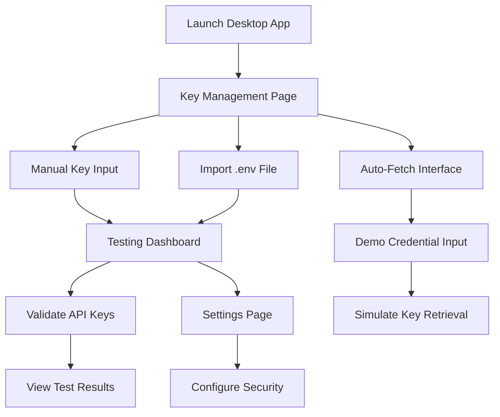

## 1. Product Overview
API Key Manager is a secure desktop application for macOS that allows users to manage API keys locally and safely. The application provides a comprehensive solution for storing, testing, and organizing API credentials for various services including trading platforms (Binance, Bybit, Oanda), AI services (OpenAI, Anthropic, OpenRouter), and development tools (GitHub).

The product solves the problem of scattered API key management by providing a centralized, secure, and user-friendly interface for developers and traders who work with multiple API services.

## 2. Core Features

### 2.1 Feature Module
Our API Key Manager consists of the following main pages:
1. **Key Management Page**: API key input forms, secure storage, import/export functionality
2. **Testing Dashboard**: API key validation, connection testing, status monitoring
3. **Auto-Fetch Interface**: Automated key retrieval simulation, credential management
4. **Settings Page**: Application preferences, security settings, data management

### 2.2 Page Details

| Page Name | Module Name | Feature description |
|-----------|-------------|---------------------|
| Key Management | API Key Forms | Input and edit API keys for 13 different services with masked display and copy functionality |
| Key Management | Import/Export | Parse .env files, export keys to .env format, bulk operations for key management |
| Key Management | Quick Access Links | Direct links to API provider dashboards with URL copying functionality |
| Testing Dashboard | Connection Testing | Validate API keys by testing actual endpoints, display connection status with visual indicators |
| Testing Dashboard | Status Monitoring | Real-time status updates, error handling, success/failure notifications |
| Auto-Fetch Interface | Credential Input | Demo interface for automated key retrieval with email/password forms |
| Auto-Fetch Interface | Simulation Engine | Mock automated login and key extraction process with progress indicators |
| Settings | Security Options | Configure encryption settings, auto-lock timers, secure storage preferences |
| Settings | Data Management | Clear all keys, backup/restore functionality, application reset options |

## 3. Core Process

**Main User Flow:**
Users launch the desktop application and navigate to the Key Management page where they can manually input API keys or import them from .env files. They can then switch to the Testing Dashboard to validate their keys against actual API endpoints. The Auto-Fetch interface provides a demonstration of automated key retrieval capabilities. Throughout the process, all sensitive data is stored securely using macOS Keychain integration.

## 4. User Interface Design

### 4.1 Design Style
- Primary colors: Dark theme with gray-900 background, blue-400 accents
- Secondary colors: Gray-800 for cards, green-600 for success, red-600 for errors
- Button style: Rounded corners with hover effects and transition animations
- Font: System font with medium weight for headers, regular for body text
- Layout style: Card-based design with tabbed navigation and responsive grid layouts
- Icon style: Lucide React icons with consistent sizing and hover states

### 4.2 Page Design Overview

| Page Name | Module Name | UI Elements |
|-----------|-------------|-------------|
| Key Management | API Key Forms | Dark input fields with password masking, copy buttons, external link icons, responsive grid layout |
| Key Management | Import/Export | Large textarea for .env content, action buttons with icons, status indicators |
| Testing Dashboard | Connection Testing | Service cards with test buttons, loading spinners, status badges with color coding |
| Auto-Fetch Interface | Credential Forms | Login form inputs, progress bars, demo warning banners with yellow styling |
| Settings | Security Options | Toggle switches, dropdown menus, confirmation dialogs with native macOS styling |

### 4.3 Responsiveness
The application is designed desktop-first with a minimum window size of 1024x768 pixels. The interface adapts to different window sizes with responsive grid layouts and collapsible sidebars for optimal space utilization on various screen sizes.
