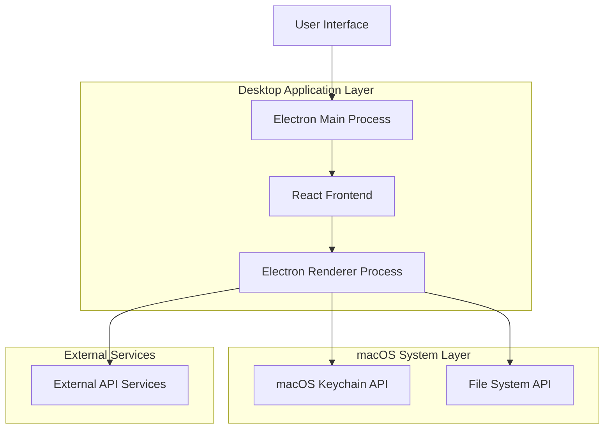
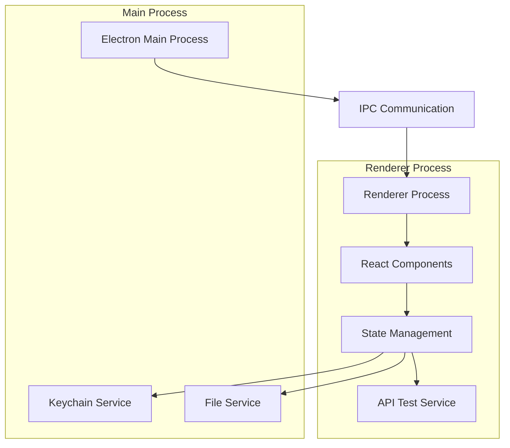
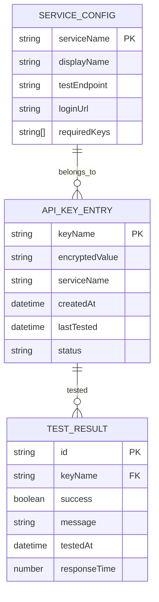

## 1. Architecture Design



## 2. Technology Description

* Frontend: React\@18 + TypeScript + Tailwind CSS\@3 + Lucide React Icons

* Desktop Framework: Electron\@latest with main/renderer process architecture

* Security: macOS Keychain integration via keytar package

* Build System: Electron Builder for macOS app packaging and distribution

* Development: Vite for fast development and hot reload

## 3. Route Definitions

| Route     | Purpose                                                             |
| --------- | ------------------------------------------------------------------- |
| /         | Main application window with tabbed interface                       |
| /manage   | Key Management tab - input, edit, and organize API keys             |
| /test     | Testing Dashboard tab - validate API key connections                |
| /auto     | Auto-Fetch Interface tab - demonstration of automated key retrieval |
| /settings | Settings tab - security preferences and data management             |

## 4. API Definitions

### 4.1 Core API

**Keychain Integration**

```typescript
// Secure storage operations
interface KeychainService {
  setPassword(service: string, account: string, password: string): Promise<void>
  getPassword(service: string, account: string): Promise<string | null>
  deletePassword(service: string, account: string): Promise<boolean>
}
```

**API Key Validation**

```typescript
// External API testing
interface ApiTestService {
  testBinanceKey(apiKey: string, secret: string): Promise<TestResult>
  testOpenAIKey(apiKey: string): Promise<TestResult>
  testGitHubToken(token: string): Promise<TestResult>
}

interface TestResult {
  success: boolean
  message: string
  responseTime?: number
}
```

**File Operations**

```typescript
// .env file handling
interface FileService {
  importEnvFile(filePath: string): Promise<Record<string, string>>
  exportEnvFile(keys: Record<string, string>, filePath: string): Promise<void>
  parseEnvContent(content: string): Record<string, string>
}
```

## 5. Server Architecture Diagram



## 6. Data Model

### 6.1 Data Model Definition



### 6.2 Data Definition Language

**Keychain Storage Structure**

```typescript
// Keychain service identifiers
const KEYCHAIN_SERVICE = 'com.apikey-manager.keys'

// API Key storage format
interface StoredApiKey {
  service: string // e.g., 'BINANCE_API_KEY'
  account: string // user identifier
  value: string // encrypted API key value
  metadata: {
    createdAt: string
    lastTested?: string
    status?: 'valid' | 'invalid' | 'untested'
  }
}

// Application preferences storage
interface AppPreferences {
  autoLockTimeout: number // minutes
  enableAutoTest: boolean
  theme: 'dark' | 'light'
  defaultExportPath: string
}
```

**Supported API Services Configuration**

```typescript
const API_SERVICES = {
  BINANCE: {
    name: 'Binance',
    keys: ['BINANCE_API_KEY', 'BINANCE_API_SECRET', 'BINANCE_TESTNET'],
    testEndpoint: 'https://api.binance.com/api/v3/account',
    loginUrl: 'https://www.binance.com/en/my/settings/api-management'
  },
  OPENAI: {
    name: 'OpenAI',
    keys: ['OPENAI_API_KEY'],
    testEndpoint: 'https://api.openai.com/v1/models',
    loginUrl: 'https://platform.openai.com/api-keys'
  },
  // ... additional services
}
```

**Security Implementation**

```typescript
// Encryption configuration for sensitive data
interface SecurityConfig {
  encryptionAlgorithm: 'AES-256-GCM'
  keyDerivation: 'PBKDF2'
  saltLength: 32
  iterations: 100000
}
```

