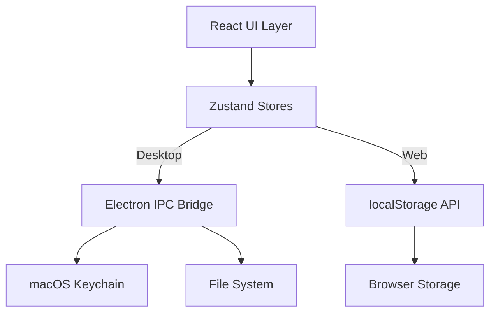

# 🔧 Developer Guide

This guide provides comprehensive information for developers working on the API Key Manager application.

## 🏗️ Architecture Overview

### Dual-Platform Design

The API Key Manager is built as a **universal application** that runs on both **macOS desktop** (via Electron) and **web browsers**, with automatic platform detection and adaptation.

```typescript
// Platform detection and adaptation
if (window.electronAPI) {
  // Desktop mode: Use macOS Keychain via Electron IPC
  const result = await window.electronAPI.keychain.setPassword(service, account, key);
} else {
  // Web mode: Use browser localStorage
  localStorage.setItem(`apikey_${service}`, key);
}
```

### Core Architecture Components



## 🛠️ Development Environment

### Prerequisites

- **Node.js**: v18+ recommended
- **macOS**: Required for desktop development and testing
- **Xcode Command Line Tools**: Required for native module compilation

### Setup

```bash
# Clone repository
git clone <repository-url>
cd api-key-manager

# Install dependencies
npm install

# Start development
npm run dev          # Desktop mode
npm run dev:web      # Web mode
```

### Development Workflow

1. **Frontend Development**: Use `npm run dev:vite` for pure frontend work
2. **Electron Development**: Use `npm run dev:electron` after frontend is running
3. **Full Stack**: Use `npm run dev` for concurrent development
4. **Web Testing**: Use `npm run dev:web` for browser-only testing

## 📁 Project Structure Deep Dive

### Source Code Organization

```
src/
├── components/              # React UI components
│   ├── tabs/               # Tab-specific functionality
│   │   ├── ManageTab.tsx   # Key CRUD operations
│   │   ├── TestTab.tsx     # API validation testing
│   │   ├── AutoFetchTab.tsx # Automated key fetching (demo)
│   │   └── TextParser.tsx  # Text parsing & extraction
│   ├── ApiKeyCard.tsx      # Individual key management
│   ├── Header.tsx          # App header with branding
│   ├── LoadingSpinner.tsx  # Loading states
│   ├── NotificationContainer.tsx # Toast notifications
│   └── TabNavigation.tsx   # Main navigation
├── stores/                 # Zustand state management
│   ├── apiKeyStore.ts      # Core business logic
│   └── uiStore.ts          # UI state management
├── data/                   # Static configurations
│   └── apiServices.ts      # API service definitions
├── types/                  # TypeScript definitions
│   └── index.ts            # Centralized type definitions
├── utils/                  # Utility functions
│   ├── apiTester.ts        # API validation logic
│   ├── fileUtils.ts        # File operations
│   └── textParser.ts       # Text parsing utilities
├── hooks/                  # Custom React hooks (future)
└── pages/                  # Page components (future)
```

### Configuration Files

- **`vite.config.ts`**: Desktop/Electron build configuration
- **`vite.config.web.ts`**: Web-only build configuration
- **`tailwind.config.js`**: Tailwind CSS customization
- **`electron/tsconfig.json`**: Electron-specific TypeScript config
- **`vercel.json`**: Web deployment configuration

## 🔄 State Management Architecture

### Store Design Philosophy

The application uses **Zustand** with a **dual-store pattern** for clear separation of concerns:

#### 1. ApiKeyStore (`src/stores/apiKeyStore.ts`)

**Responsibility**: Business logic and data persistence

```typescript
interface ApiKeyStore {
  // State
  keys: Record<string, ApiKey>;
  isLoading: boolean;
  error: string | null;

  // Actions
  setKey: (service: string, value: string) => Promise<void>;
  getKey: (service: string) => Promise<string | null>;
  deleteKey: (service: string) => Promise<void>;
  testKey: (service: string) => Promise<boolean>;
  loadKeys: () => Promise<void>;
  
  // Import/Export
  importFromEnv: (content: string) => Promise<void>;
  exportToEnv: () => string;
}
```

**Key Features**:
- **Platform Abstraction**: Automatically chooses Keychain or localStorage
- **Optimistic Updates**: Updates UI immediately, with rollback on failure
- **Error Handling**: Comprehensive error handling with user feedback
- **Validation**: Real-time API key testing against live endpoints

#### 2. UiStore (`src/stores/uiStore.ts`)

**Responsibility**: UI state and user experience

```typescript
interface UiStore {
  // Navigation
  activeTab: TabType;
  setActiveTab: (tab: TabType) => void;

  // Notifications
  notifications: Notification[];
  showSuccess: (message: string) => void;
  showError: (message: string) => void;
  
  // UI State
  searchQuery: string;
  selectedCategory: string;
  isTestingAll: boolean;
}
```

### Data Flow Patterns

```typescript
// 1. User Action → Store Action → Platform API → State Update
const handleSaveKey = async () => {
  try {
    await setKey(serviceId, keyValue);  // Store action
    showSuccess('Key saved successfully'); // UI feedback
  } catch (error) {
    showError(error.message);           // Error handling
  }
};

// 2. Reactive UI Updates via Zustand subscriptions
const { keys, isLoading } = useApiKeyStore();
const { notifications } = useUiStore();
```

## 🎨 UI Component Architecture

### Component Design Principles

1. **Single Responsibility**: Each component has a focused purpose
2. **Composition over Inheritance**: Components are composed, not extended
3. **Props Down, Events Up**: Unidirectional data flow
4. **Accessibility First**: WCAG 2.1 AA compliance
5. **Type Safety**: Full TypeScript coverage

### Key Components Deep Dive

#### ApiKeyCard Component

**Most Complex Component** - handles complete key lifecycle:

```typescript
interface ApiKeyCardProps {
  service: ApiService;
  apiKey?: ApiKey;
  onSave: (service: string, value: string) => Promise<void>;
  onDelete: (service: string) => Promise<void>;
  onTest: (service: string) => Promise<boolean>;
}
```

**Features**:
- **Edit Mode**: In-place editing with save/cancel
- **Security**: Key masking with show/hide toggle
- **Validation**: Real-time testing with visual feedback
- **Actions**: Save, delete, test, copy, external links

**State Management**:
```typescript
const [isEditing, setIsEditing] = useState(false);
const [isVisible, setIsVisible] = useState(false);
const [isTesting, setIsTesting] = useState(false);
const [editValue, setEditValue] = useState('');
```

#### Tab Components

Each tab implements the `TabComponent` pattern:

```typescript
interface TabComponentProps {
  isActive: boolean;
}

// Implementation example
const ManageTab: React.FC<TabComponentProps> = ({ isActive }) => {
  if (!isActive) return null;
  
  // Tab-specific logic
  return <TabContent />;
};
```

### Styling System

#### Tailwind CSS Configuration

**Custom Design Tokens** (`tailwind.config.js`):

```javascript
theme: {
  extend: {
    colors: {
      primary: { 50: '#eff6ff', 500: '#3b82f6', 900: '#1e3a8a' },
      gray: { 50: '#f9fafb', 500: '#6b7280', 900: '#111827' }
    },
    animation: {
      'fade-in': 'fadeIn 200ms ease-in-out',
      'slide-up': 'slideUp 300ms ease-out'
    }
  }
}
```

**Component Classes** (`src/index.css`):

```css
/* Button System */
.btn {
  @apply px-4 py-2 rounded-lg font-medium transition-colors duration-200;
}
.btn-primary {
  @apply bg-primary-500 text-white hover:bg-primary-600;
}
.btn-outline {
  @apply border border-gray-300 text-gray-700 hover:bg-gray-50;
}

/* Card System */
.card {
  @apply bg-white border border-gray-200 rounded-lg shadow-sm;
}
.card-header {
  @apply px-6 py-4 border-b border-gray-200;
}
```

## ⚡ Performance Optimization

### React Performance Patterns

```typescript
// 1. useMemo for expensive computations
const filteredKeys = useMemo(() => {
  return Object.values(keys).filter(key => 
    key.service.toLowerCase().includes(searchQuery.toLowerCase())
  );
}, [keys, searchQuery]);

// 2. useCallback for event handlers
const handleKeyChange = useCallback((service: string, value: string) => {
  setKey(service, value);
}, [setKey]);

// 3. Conditional rendering for performance
const renderTab = () => {
  switch (activeTab) {
    case 'manage': return <ManageTab />;
    case 'test': return <TestTab />;
    default: return null;
  }
};
```

### Bundle Optimization

**Vite Configuration** optimizations:

```typescript
// vite.config.ts
build: {
  rollupOptions: {
    output: {
      manualChunks: {
        vendor: ['react', 'react-dom', 'zustand'],
        ui: ['lucide-react', 'tailwindcss'],
        stores: ['./src/stores/apiKeyStore', './src/stores/uiStore']
      }
    }
  }
}
```

## 🛡️ Security Implementation

### Electron Security Architecture

**Main Process** (`electron/main.ts`):
- Handles all privileged operations
- Validates all IPC requests
- Implements CSP headers
- Manages window creation security

**Preload Script** (`electron/preload.ts`):
```typescript
// Secure context bridge - limited API exposure
const electronAPI = {
  keychain: {
    setPassword: (service: string, account: string, password: string) =>
      ipcRenderer.invoke('keychain-set', service, account, password),
    getPassword: (service: string, account: string) =>
      ipcRenderer.invoke('keychain-get', service, account),
    // Only specific methods exposed
  }
};

contextBridge.exposeInMainWorld('electronAPI', electronAPI);
```

### Web Security Considerations

**Browser Storage**:
- Keys stored in `localStorage` (encrypted at browser level)
- CSP headers prevent XSS attacks
- HTTPS-only in production
- No server-side storage

### Security Best Practices

1. **Input Validation**: All user inputs validated before processing
2. **Error Sanitization**: Error messages don't leak sensitive information
3. **Minimal Exposure**: Keys masked by default, shown only on user request
4. **Secure Defaults**: All security features enabled by default

## 🧪 Testing Strategy

### Manual Testing Approach

The application uses **built-in testing functionality** rather than separate test suites:

1. **API Validation**: Real endpoint testing for immediate feedback
2. **Platform Testing**: Test both Electron and web versions
3. **Error Simulation**: Test error conditions and edge cases

### Quality Assurance Checklist

**Before Release**:
```bash
# Code quality
npm run check        # TypeScript + ESLint
npm run lint         # Code style

# Build testing
npm run build        # Verify builds succeed
npm run build:web    # Verify web build

# Manual testing
npm run dev          # Desktop functionality
npm run dev:web      # Web functionality
```

## 🚀 Deployment Guide

### Desktop Application

**Build Process**:
```bash
# 1. Build application
npm run build

# 2. Create installer
npm run dist:mac

# 3. Output location
ls release/          # .dmg files created here
```

**Code Signing** (Production):
```bash
# Set environment variables
export CSC_LINK=path/to/certificate.p12
export CSC_KEY_PASSWORD=certificate_password

# Build with signing
npm run dist
```

### Web Application

**Build Process**:
```bash
# Build for web
npm run build:web

# Output
ls dist-web/         # Static files for deployment
```

**Deployment** (Vercel example):
```json
// vercel.json
{
  "builds": [
    {
      "src": "vite.config.web.ts",
      "use": "@vercel/static-build"
    }
  ],
  "routes": [
    {
      "src": "/(.*)",
      "dest": "/index.html"
    }
  ]
}
```

## 🔧 Adding New Features

### Adding a New API Service

1. **Update Service Configuration** (`src/data/apiServices.ts`):
```typescript
{
  id: 'new-service',
  name: 'New Service',
  keyName: 'NEW_SERVICE_API_KEY',
  testEndpoint: 'https://api.newservice.com/v1/test',
  testMethod: 'GET',
  testHeaders: { 'Authorization': 'Bearer {key}' },
  category: 'ai',
  // ... additional config
}
```

2. **UI Automatically Adapts**: No additional UI code needed

3. **Test Implementation**: Service automatically appears in test tab

### Adding a New Tab

1. **Create Tab Component** (`src/components/tabs/NewTab.tsx`):
```typescript
import React from 'react';

interface NewTabProps {
  isActive: boolean;
}

const NewTab: React.FC<NewTabProps> = ({ isActive }) => {
  if (!isActive) return null;
  
  return (
    <div className="space-y-6">
      {/* Tab content */}
    </div>
  );
};

export default NewTab;
```

2. **Update Navigation** (`src/components/TabNavigation.tsx`):
```typescript
const tabs = [
  { id: 'manage', label: 'Manage', icon: Settings },
  { id: 'new-tab', label: 'New Feature', icon: NewIcon },
  // ... existing tabs
];
```

3. **Update App Router** (`src/App.tsx`):
```typescript
const renderActiveTab = () => {
  switch (activeTab) {
    case 'new-tab':
      return <NewTab isActive={true} />;
    // ... other cases
  }
};
```

## 🐛 Debugging Guide

### Common Issues

**Keychain Access Denied**:
- Check macOS Security & Privacy settings
- Verify app is properly signed
- Reset keychain if corrupted

**Build Failures**:
- Clear node_modules: `rm -rf node_modules && npm install`
- Clear build cache: `npm run clean`
- Check TypeScript errors: `npm run check`

**IPC Communication Issues**:
- Verify preload script loading
- Check context isolation settings
- Validate IPC channel names

### Development Tools

**Electron DevTools**:
```typescript
// Enable in development
webPreferences: {
  devTools: process.env.NODE_ENV === 'development'
}
```

**React DevTools**: Available in browser version automatically

**Zustand DevTools**:
```typescript
import { devtools } from 'zustand/middleware';

const store = create(devtools(storeImplementation, {
  name: 'api-key-store'
}));
```

## 📚 Additional Resources

- **Electron Documentation**: https://electronjs.org/docs
- **React Documentation**: https://react.dev
- **Zustand Guide**: https://zustand-demo.pmnd.rs
- **Tailwind CSS**: https://tailwindcss.com/docs
- **TypeScript Handbook**: https://typescriptlang.org/docs

## 🤝 Contributing Guidelines

1. **Code Style**: Follow existing patterns and use provided linting
2. **Type Safety**: Maintain 100% TypeScript coverage
3. **Testing**: Test both desktop and web versions
4. **Documentation**: Update docs for any architectural changes
5. **Security**: Follow security best practices, especially for key handling

---

**Need Help?** Check the troubleshooting section or open an issue on GitHub.